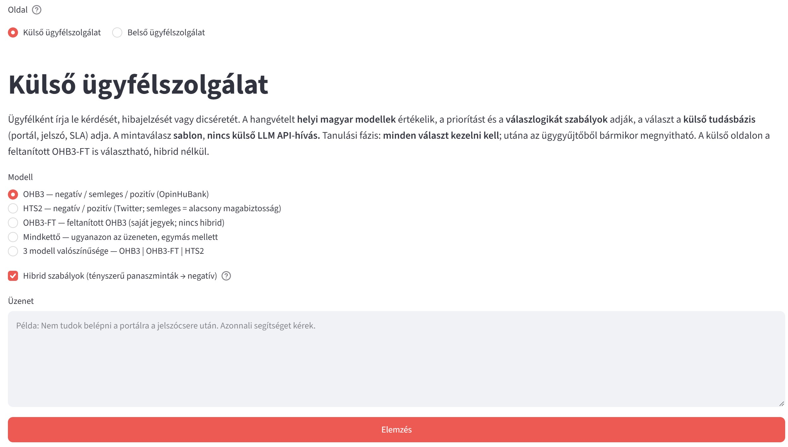
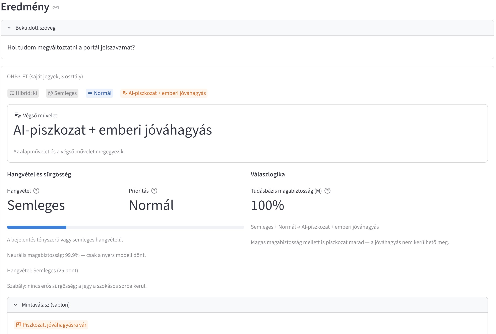
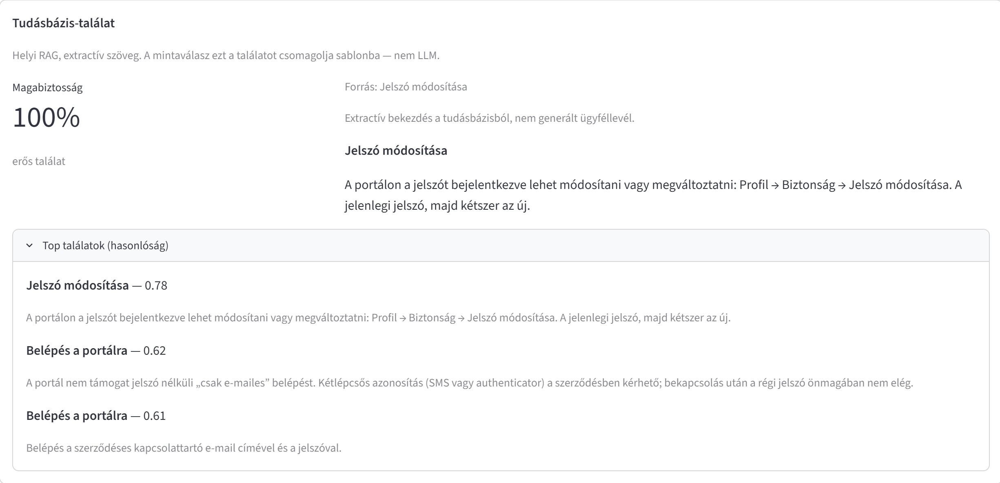
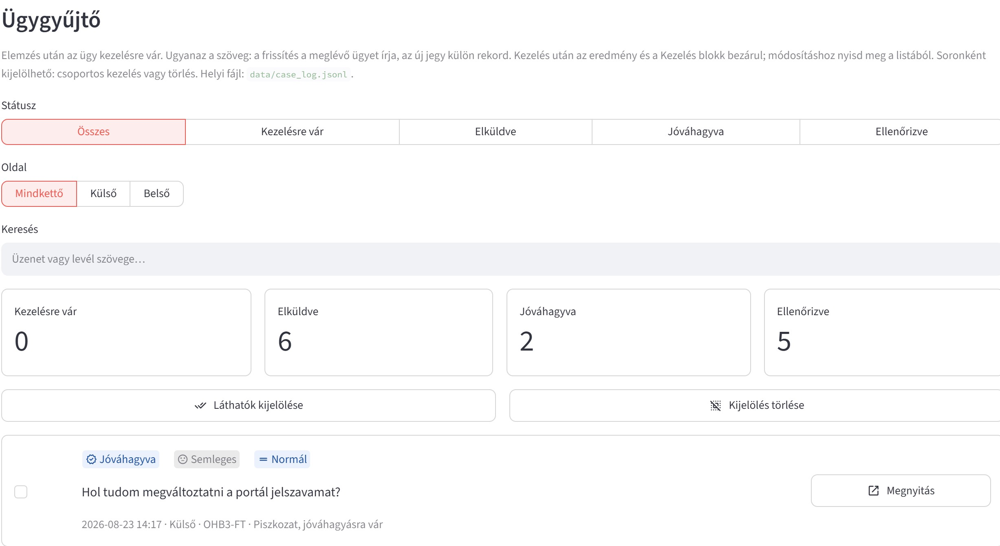
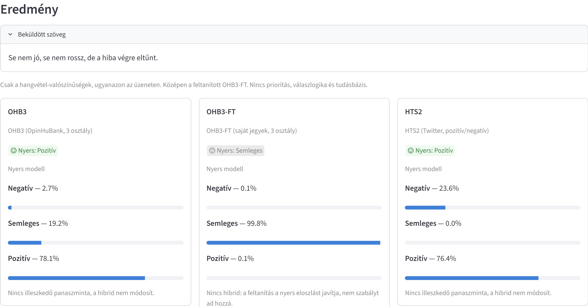
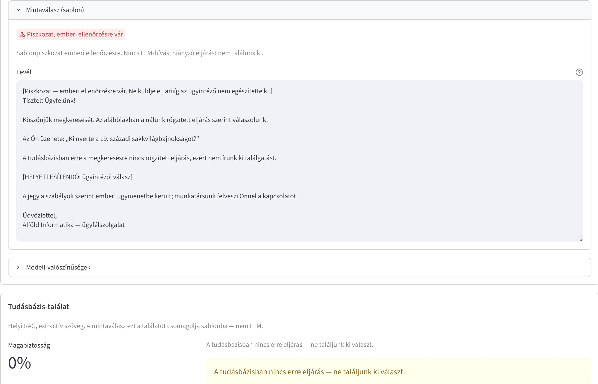
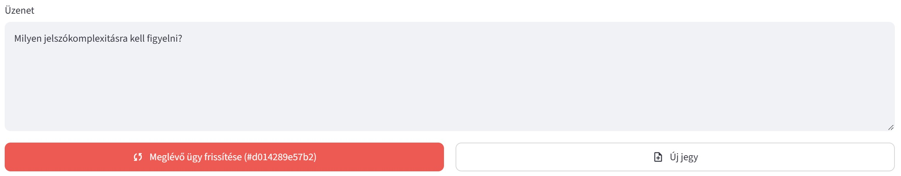

# Ügyfélszolgálati AI prototípus — bemutató

Egy ügyfélszolgálati portál, két megjelenés: az **IP** dönti el, hogy ügyfél- vagy dolgozói felületet kapsz.

**Kívül** a hangvételt saját jegyeiden feltanított modell pontozza. **Belül** a válasz a céges tudásbázisból jön (RAG).

Sentiment, priorítás, magabiztosság, ügykezelés — a válasz sablonból készül, nem külső nyelvi modellből.

A fiktív cég: **Alföld Informatika**. Helyi magyar modellek, **nincs LLM API**. A demóban az oldal most kézi kapcsoló; élesben az IP választana.

Ez a **nyilvános bemutató**: tech, rövid ív és képernyőképek. Nincs itt a futtatható kód, a modellek és a címkézett jegyek. A lépések összesűrítve: [`HALADAS.md`](HALADAS.md).

A fejlesztés AI-asszisztált módszerrel (vibe coding) készül(t).

## Tech

| | |
| --- | --- |
| Felület | Python, Streamlit |
| Hangvétel | NYTK huBERT: OHB3 (3 osztály), HTS2 (2 osztály + küszöb), OHB3-FT (saját jegyek, FT5) |
| Hibrid | Szabályréteg tényszerű panaszmintákra (OHB3-FT-n ki) |
| Prioritás / logika | Szabályok, egy lépés, nincs kaszkád |
| RAG | `paraphrase-multilingual-MiniLM-L12-v2`, bekezdés, numpy cosine, 0% → nincs kitalált eljárás |
| Levél | Sablon a találatból; `[HELYETTESÍTENDŐ]` ha nincs eljárás |
| Adat | Helyi JSONL ügygyűjtő; a tanító CSV és a súlyok gitignore |

CPU elég. Az első futás Hub-letöltés; utána cache.

## Hol tart

A tanulási kör összejött: elemzés → sablon → kötelező kezelés → szűrhető ügygyűjtő (frissítés vs. új jegy, kijelölés, törlés). FT5 a 12 érintetlen evalon **10/12**. A Hub-os OHB3 megmaradt, hogy a feltanítás összevethető legyen.

Hogyan jutott ide (egy mondat / lépés): helyi két modell → priorítás → RAG → egy lépéses logika → két oldal → FT harmadik modellként → sablon + ügygyűjtő → cinikus 0 javítás. A lyukak (langyos 1, jelszó-bekezdés, holdout ≠ eval) a naplóban vannak.

## Működés — bemutató

A képek a [`kepek/`](kepek/) mappában vannak.

### 1. Ugyanaz a képernyő, két oldal

Külső (ügyfél) vagy belső (dolgozó). Egy üzenetmező, nincs típusválasztó. A modell helyben fut.

### 2. A válasz a tudásbázis bekezdése

„Hol tudom megváltoztatni a portál jelszavamat?” → Semleges, M **100%**, piszkozat (a tanulási fázisban a jóváhagyás nem kerülhető meg). A találat *Jelszó módosítása*: *Profil → Biztonság → Jelszó módosítása* — nem az első belépés, nem generált levél.

Kezelés után a blokk bezárul; az ügy a listában marad.

### 3. A feltanítást a bázis mellett kell nézni

„Se nem jó, se nem rossz, de a hiba végre eltűnt.” — evalon **1**, az FT5 eltalálta. A bázis OHB3 és az HTS2 **pozitív** (a hiba eltűnt), az FT **semleges**. A Hub-os OHB3 ezért marad a sáv mellett; a holdout 100% ezt a különbséget nem mutatta volna.

### 4. Ha nincs eljárás, nincs kitalált levél

Irreleváns kérdés → M 0%, `[HELYETTESÍTENDŐ]`, emberi ellenőrzés.

### 5. Ugyanaz a szöveg: frissítés vagy új jegy

Nem klónoz automatikusan. A gombon látszik, melyik `#id` frissül.

## Mit nem állítok

A holdout nem gyártási pontosság. Az eval 12 mondat kicsi. Nincs Gemini/Groq-levél. A cég fiktív. Az IP-alapú oldal a termékterv, a képernyőn most rádió van.
